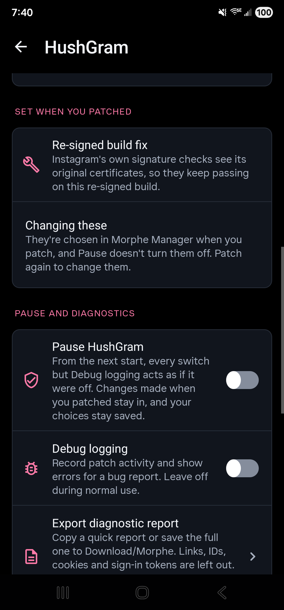

<p align="center">
  
  <a href="LICENSE"></a>
  
  
  
</p>

#  HushGram

HushGram is a Morphe patch bundle for Instagram on Android. It hides the ads, keeps the tracking keys off the links you share, and stops Instagram from sending its usage events home.

It's the Instagram member of a small family. [Hushfacebook](https://github.com/SysAdminDoc/Hushfacebook) does the same job for Facebook, and HushGram is built on its foundation: the same settings screen, pause switch, diagnostics and checks.

The latest release is [v0.0.2](https://github.com/SysAdminDoc/HushGram/releases/tag/v0.0.2), with 21 patches. It's the first one. Add it to Morphe Manager with [this link](https://morphe.software/add-source?github=SysAdminDoc%2FHushGram).

This project has no connection to Meta or to the Morphe project. Neither endorses it, and neither wrote it.

## Why use it

- **No sponsored posts.** Ads in the feed, Reels and Stories don't go in, and Instagram doesn't leave a gap where they would have been.
- **Cleaner links.** When you copy a link or share one, through Android's share sheet or straight to WhatsApp or another app from Instagram's own, `stkn` (the per-share id Instagram adds now), `igsh`, `utm_source` and the other tracking keys come off. The link still opens the same post. A link in someone's bio opens its page directly, not through `l.instagram.com`, Instagram's click tracker.
- **Less sent home.** Instagram's usage events and crash reports go to an address on your own phone that refuses them.
- **A build that keeps working.** A patched Instagram doesn't update itself, and Instagram locks out an old build after a few weeks. HushGram stops that lockout screen.

Every feature has its own switch, and one Pause switch turns them all off at once when you want to see whether HushGram is behind something odd.

## Install

1. Install [Morphe Manager](https://github.com/MorpheApp/morphe-manager) 1.32.0 or newer.
2. Add HushGram as a patch source: https://morphe.software/add-source?github=SysAdminDoc%2FHushGram (or build the bundle yourself, below, and add the `.mpp` file from your phone's storage).
3. Get Instagram 449.0.0.52.84 from [APKMirror](https://www.apkmirror.com/apk/instagram/instagram-instagram/). Take the variant labelled (arm64-v8a) (640dpi) (Android 9.0+), build 385511871. That's the one these patches are checked against. APKMirror carries other arm64-v8a builds of the same version, and Morphe Manager warns about those because they haven't been checked yet.
4. Uninstall the Instagram you got from the Play Store. The patched app is signed with your own key, so Android won't install it over Meta's. Uninstalling signs you out, so have your password (and your two-factor codes) ready.
5. In Morphe Manager, pick the Instagram file, keep the default patch selection or change it, and patch.

HushGram supports arm64-v8a phones on Android 9 and newer, which is what Instagram 449 itself asks for.

Instagram ships a new version every week and renames most of its code each time. Each patch finds what it changes by things Instagram keeps from one build to the next (log strings, server field names, manifest components and Android's own calls) rather than by the names that change. When one can't find its target, patching stops with a message saying what's missing, instead of giving you an app that quietly does nothing. Please report a stop like that.

## Before you sign in

> [!WARNING]
> How you first sign in matters more than anything else for keeping your account. Almost every reported suspension happens when someone logs a brand-new or long-idle account into a freshly patched build for the first time. Instagram asks Google's Play Integrity service and your phone's hardware to vouch that the app is the unmodified one from the Play Store, and a re-signed build can't pass that. Those checks run at sign-in, so the sign-in is the moment that counts. Here's how to lower the risk.
>
> - **Use an account you've had and actually used for a while.** A seasoned account is treated far better than a new or dormant one. If you'd rather not put the account you care about on the line, sign in with a spare one first and see how it goes.
> - **If your phone is rooted, use Morphe Manager's Root Mount install.** It layers HushGram over the Play Store Instagram instead of replacing it, so you stay logged in and never do a fresh login on the patched app. That's the lowest-risk path.
> - **Without root, your first login happens on the patched app, and that's the careful moment.** Uninstalling the Play Store Instagram (install step 4) signs you out, so you'll log back in on HushGram. Do it on a seasoned account, on your normal home network, and if Instagram asks you to confirm your phone number or that you're a real person, go ahead and complete it.
> - **Afterward, leave Instagram's storage and data alone.** Clearing them forces another fresh login down the same risky path. When a new Instagram version comes out, patch it and install over the top with the same key, which keeps you logged in.

## Keep your signing key

Morphe Manager signs the patched Instagram with a key it makes on your phone. Android only installs an update over your patched Instagram when the update carries that same key, so the key is what lets you update without losing Instagram's data.

- **Back it up right after your first patch.** In Morphe Manager, open Settings → System → Import & export → Signing key and tap Export. Keep the `Morphe.keystore` file somewhere private, because anyone who has it can sign an APK your phone will take as an update.
- **On a new phone, import it before you patch anything.** Reinstalling Morphe Manager or clearing its storage makes a new key, and without your exported copy nothing you patched earlier can be updated in place.
- **A different key means starting over.** Android refuses an update signed with another key, so the only way forward is to uninstall the patched Instagram. That deletes its data and signs you out.

Morphe's own guide is [Backup and keystore](https://github.com/MorpheApp/morphe-manager/blob/main/docs/backup-and-keystore.md).

## Patches

There are 29 patches for `com.instagram.android`, checked against Instagram 449.0.0.52.84 (arm64-v8a, build 385511871). The eight newest, Open developer options, Start on x86 devices, Keep the reel speed, Hide suggested posts, Hide Meta AI, Hide the Explore grid, Start Home on Following and Hide suggested stories, come after v0.0.2 and go out with the next release.

| Patch | What it does |
|---|---|
| `Clean up Reels` | Hides the Follow button on reels, the pills that push Edits, templates, Meta AI and Ray-Ban Meta glasses, and friends' activity with the comment preview. Each part has its own switch. |
| `Default playback quality` | Plays videos, reels and video stories at the quality you choose in HushGram's settings, such as Data saver or up to 720p, instead of the one Instagram picks as it plays. |
| `Disable analytics` | Sends Instagram's usage events and crash reports to an address on your phone that refuses them, instead of to Instagram's and Facebook's servers. It also skips the contacts and location setup screens, which would come back on every start without those events. Restart Instagram after changing the switch. |
| `Don't send reel watch history` | Stops telling Instagram which reels you watched and how far into them you got. It's used to rank your Reels, and nobody else sees it. Reels you've already watched may come back. |
| `Download any reel` | Adds Download to every reel's more menu. Reels save at the Download quality you set, best by default, without Instagram's watermark. |
| `Download any story` | Adds Download to the menu of anyone's story. A video saves at the Download quality you set, a photo at its largest size. |
| `Download any video` | Adds Download to the menu of a post in your feed with a video, and of a carousel showing a video. Videos save at the Download quality you set, without Instagram's watermark. A second switch does the same for photo posts. |
| `Hide ads` | Hides sponsored posts, reels and stories. Instagram is told the ad didn't go in, so no gap is left where it would have been. |
| `Hide Meta AI` | Takes Meta AI out of the search bars, in the Search tab and at the top of your messages, so they search the plain way, drops the Ask a follow-up bar under search results and Meta AI's buttons in Home's top bar, and removes Meta AI's posts from your home feed. Each has its own switch, and the search one shows once Instagram restarts. |
| `Hide Reels in the feed` | Removes the rows of suggested reels between posts in your home feed, and the other units that open the Reels viewer from there. A reel someone you follow posts stays. |
| `Hide the Explore grid` | Empties the grid of posts and reels under the Search tab's bar. Search, your recent searches and search results stay. |
| `Hide suggested posts` | Removes the posts and reels from accounts you don't follow that Instagram puts in your home feed as Suggested for you, the rows of accounts, shops and hashtags it suggests you follow, and the posts and accounts from Threads it mixes in. Each has its own switch. Posts from accounts you follow stay. |
| `Hide suggested stories` | Removes the stories from accounts you don't follow, and the accounts Instagram suggests, from the row of stories at the top of Home. A second switch, off to start, takes the whole row away. |
| `Hide the Reels tab` | Takes the Reels tab off the tab bar, and a start or a notification meant for it opens Home. Reels in your feed and reels people send you still open, and a change to the switch shows once Instagram restarts. |
| `HushGram settings` | Adds HushGram settings to Instagram. Long-press Instagram's launcher icon and pick HushGram settings, or tap HushGram settings at the top of Instagram's Settings and activity, to turn features on or off, pause HushGram and export diagnostics. The licenses are there too. |
| `Keep the reel speed` | Lock a reel at 2x with Instagram's own lock (hold its edge, then slide down) and the next reels play at 2x too, until you slide the lock off, hold the edge and let go, or Instagram restarts. |
| `Open developer options` | A long press on the Home tab opens Instagram's own developer options, where its server flags (MetaConfig and quick experiments) can be looked at and overridden on your phone. A wrong flag can break parts of Instagram until you reset it there. |
| `Open links in external browser` | Opens a web link you tap in your default browser instead of Instagram's in-app browser, without Instagram's click tracker. Instagram and other Meta pages, and ads, still open in the app. |
| `Remove build expired popup` | Stops Instagram from locking you out with a screen that says this version is too old. A patched build doesn't update on its own, so without this it would stop working after a few weeks. |
| `Remove the advertising ID` | Instagram can't read your phone's advertising ID or tell Android's ad services which ads you saw or tapped. The permissions for them are taken out of the build, so Google Play services hands Instagram a string of zeros in place of the ID. |
| `Restore trust on re-signed builds` | Lets Instagram's own signature checks pass on a re-signed build, so the parts of the app that check who signed it keep working. A Root Mount install doesn't need this patch. |
| `Resume long videos` | A video or reel longer than two minutes that you left partway picks up where you left it the next time it plays. Live videos and ads start as usual. Its switch starts off. |
| `Sanitize sharing links` | Takes stkn, igsh, utm_source and Instagram's other tracking keys off the links you copy or share, and opens a bio link without going through Instagram's click tracker. The post, reel, story or profile a link opens stays the same. |
| `Start Home on Following` | Opens Home on posts from accounts you follow. Tap Following at the top to switch to For you, and Home remembers your pick. A change to the switch shows once Instagram restarts. |
| `Start on x86 devices` | Keeps Instagram from crashing or freezing on an x86 device that runs its arm code through a translator, such as an x86 Chromebook or an emulator, by skipping the one code protection step that breaks there. Phones and tablets with arm chips run it as before. |
| `Stop Story auto-advance` | Keeps each story on screen until you tap or swipe. Turn the switch off for Instagram's timing. |
| `Tap to play` | Videos, reels and stories wait for your tap instead of starting by themselves. Feed videos show a play button, the way they do when Instagram saves mobile data. |
| `Turn off double tap to like` | Stops a double tap on a post or a reel from liking it, and the heart doesn't show. A single tap still does what it did, and the Like button still likes. |
| `View stories anonymously` | Keeps you off the viewer list of the stories you watch, because Instagram isn't told which ones you've seen. Replying or reacting still shows you, and stories you've watched keep showing as new. |

The other patches keep their switches in `HushGram settings`, so Morphe Manager includes it whenever any of them is picked. Any of the rest can be left out when you patch.

## Settings

Long-press Instagram's icon on your home screen and tap **HushGram settings**. Or, inside Instagram, open **Settings and activity** from the menu on your profile and tap **HushGram settings** at the top. The screen opens over Instagram, and the shortcut works before you sign in too.

<p>
  
  
</p>

At the top, a card says whether HushGram is on or paused. Below it:

- **Ads and privacy** holds the switches for Hide ads, Sanitize sharing links, Open links in external browser and Disable analytics.
- **Feed** holds the switch for Start Home on Following and Hide suggested posts' three: Hide suggested accounts, Hide suggested posts and Hide Threads posts.
- **Meta AI** holds Hide Meta AI's two switches: Hide Meta AI in search and Home's bar, and Hide Meta AI posts.
- **Explore** holds the switch for Hide the Explore grid.
- **Reels** holds the switches for Hide Reels in the feed, the three parts of Clean up Reels, Don't send reel watch history, Download on reels, Turn off double tap to like, Hide the Reels tab and Keep the reel speed.
- **Stories** holds Hide suggested stories' two switches, Hide suggested stories and Hide the Stories tray, and the switches for Stop Story auto-advance, View stories anonymously and Download on stories.
- **Playback** holds the switches for Tap to play and Resume long videos, and Default playback quality with its Playback quality list: Auto, Data saver, Up to 480p, Up to 720p or Highest.
- **Downloads** holds the switches for Download feed videos and Download feed photos, lists each save that's running, with a Cancel button, and holds what every save uses: Save videos other apps can open, Download quality, the save folder and the video file name. Videos go to Movies and photos to Pictures, each in an Instagram folder unless you name another, and a video is named `IG_VID_` with the date and time unless you set a name.
- **Updates** holds the switch for the build expired screen.
- **Developer** holds the switch for Open developer options.
- **Set when you patched** lists what was fixed at patch time and can't be switched off here, such as the re-signed build fix and the removed advertising ID.
- **Pause and diagnostics** has the Pause switch, Debug logging, and the diagnostic report. Copy a quick report, or save the full one to Download/Morphe (on Android 9, a Download/Morphe folder inside Instagram's own folder, and the message says where). Links, IDs, cookies and sign-in tokens are left out, but read it over for other private text before you share it.
- **About** shows the version and the licenses, with a link to this page.

Pause turns off every feature a switch controls, all at once and without losing your choices. It's the quickest way to tell whether HushGram is behind a problem.

If Instagram crashes within a minute of starting three times in a row, HushGram pauses itself and the card says why. Turn it back on from the same screen once you've patched again or left out the patch at fault. When Instagram won't stay open long enough to reach the settings, create an empty file named `hushgram-safe-mode` in `Android/data/com.instagram.android/files` (a computer or a file manager can reach it), and HushGram starts paused until you delete it.

## Known limitations

- Sanitize sharing links covers Copy link, the Android share sheet, the app buttons in Instagram's own share sheet, a profile's share link and the post and story links Instagram's server hands out. Bio links open without Instagram's click tracker. Links in messages and story link stickers haven't been checked on a phone yet.
- Clean up Reels has only been seen on a phone with an account that follows almost no one, so the Follow button is the part checked there. The pills and friends' activity are hidden by the same kind of hook but haven't shown up on that account yet.
- Don't send reel watch history keeps reels out of the list from the moment it's on. A list Instagram saved before you patched can still go out once.
- Download any reel saves the reel's video. A photo post that turns up in Reels has no video to save, so Download says it failed there.
- Download any story adds its row to the menu you get from the three dots on a story, yours included, and to the older menu some special story cards still use.
- Download any video is off until you pick it in Manager. It adds the row to anyone else's feed post that is one video, at the top of the short menu most posts open now (the one with Why you're seeing this, Interested and Report, under an About this reel summary on a reel). Your own posts keep Instagram's own Download row where Instagram shows it, and on a video that row saves through HushGram too. On a carousel, the row follows the page you're on: a video page gets it and saves that page. On a phone, each page of a three-video carousel saved its own video. A photo, a photo post or a carousel's photo page, gets the row only with Download feed photos on in HushGram settings, which is off until you turn it on. A tap then saves the largest size Instagram has to Pictures, and your own photo posts save through HushGram too.
- Tap to play is off until you pick it in Manager. Instagram doesn't say whether a tap started a video, so any start within a second of a tap goes ahead, and so does its first start within four seconds, for a story or a video that's slow to load. A video you started keeps playing through a seek or a loop until it's paused or swapped for another. Instagram's own tap in Reels only resumes a reel you paused yourself, so HushGram sends a tap on a reel that's waiting to start, or paused for something like the comments, down that same resume path. Stories work the same way with a press and hold: letting go resumes only a story that was playing when you pressed, so HushGram starts a waiting story when you let go of a hold. A quick tap still moves to the next or previous story. In the feed, the play button Instagram draws over a video, a reel or a carousel page is hidden once your tap starts it and comes back when it stops, since Instagram itself would leave it over the playing video.
- View stories anonymously is off until you pick it in Manager. It holds back each story you watch from the moment its switch is on, and a story you watched before that has already been counted. Only the viewing report stops, so a reply or a reaction still shows you.
- Resume long videos is in by default, but its switch under Playback starts off. Once it's on, HushGram keeps the IDs of up to 200 videos you left partway, on your phone only, and drops each after 30 days. Instagram posts nearly every video as a reel, so reels over two minutes resume too. Story clips run under two minutes, so they always start at the beginning.
- Default playback quality is off until you pick it in Manager. Once it's in, its switch under Playback starts on and the list starts at Auto, Instagram's own choice, so nothing changes until you pick a quality. Data saver takes the lowest quality Instagram offers for a video, Up to 480p and Up to 720p the best at or under that, and Highest the best there is. A video with nothing at or under your pick plays the closest quality above it, and a video Instagram sends as a single file plays as it comes. Instagram has no quality menu of its own, so this list is the only place to pick one. A change takes effect from the next video that starts. Videos Instagram loads ahead of time or saves for later still come at the quality it picks, so Data saver lowers what you watch rather than everything Instagram downloads. On a phone, the same reel started at 240p with Data saver and at 1080p with Highest, and a video story took the pick too.
- Turn off double tap to like is off until you pick it in Manager. It covers every kind of post in your feed (photos, carousels and videos alike) and the Reels viewer. A double tap on a comment, a message or a note still likes it, and double tap to skip in Reels works as before.
- Hide suggested posts takes out what Instagram sends as a suggestion, so if nobody you follow has posted lately, your home feed has nothing left to show and stays on Instagram's loading placeholder. Turn Hide suggested posts off under Feed to get the suggestions back. On a test account that follows nobody who's posted in a month, about 380 suggested posts came out as Instagram started and none after, so Instagram doesn't keep fetching more. A row of suggested accounts didn't come up while the switch was being checked on a phone, so that half has only been checked in tests. Hide Threads posts hasn't met a Threads post on a test phone yet, so it's only been checked in tests too.
- Start Home on Following is off until you pick it in Manager. It turns on the feed picker Instagram is trying out at the top of Home, so the Instagram logo gives way to the feed's name with an arrow, and the picker offers For you next to Following and Favorites. Home starts on Following until you pick another feed there, and Instagram remembers each pick through a restart. On a test account whose follows hadn't posted in a month, Home opened on Instagram's "End of following" card. With Hide suggested posts on, For you on an account like that stays on Instagram's loading placeholder, the same way Home does.
- Hide suggested stories reads the kind of story Instagram sends with each item in the row, so a suggested account's story goes and every story from someone you follow stays. None of the test accounts gets suggested stories in that row, so that half has only been checked in tests and against the app's code. Hide the Stories tray was checked on a phone: with it on, the row was gone after a restart, Your story included, and it came back with the switch off.
- Hide Meta AI covers the two search bars, the Ask a follow-up bar and its topic pills under a search's results, Meta AI's buttons in Home's top bar and the Meta AI posts in your home feed. Meta AI still shows up in the message composer and in the Ask Meta AI prompts some screens show. The Home buttons only come on some accounts, and none of the test accounts gets one, so that part has only been checked against the app's code.
- Hide the Explore grid is off until you pick it in Manager. Explore's pages arrive empty and Instagram isn't asked for more on its own, so the Search tab shows its bar, Add interests and a small load more button where the grid was. That button fetches one more page, which comes back empty too, and then it stays a spinner. A pull to refresh does the same. Typing a search, your recent searches and search results work as before. A change to the switch shows the next time Explore loads a page.
- Hide the Reels tab is off until you pick it in Manager. Instagram builds its tab bar as it starts, so the switch takes effect after a restart. If your account opens on Reels, it opens on Home instead. Reels in your feed, reels people send you and the reels on a profile still play.
- Keep the reel speed works with the 2x lock Instagram is still trying out in Reels, so an account without that lock gets nothing from it. Instagram labels only the reel you locked, so the next reels play at 2x without the label, and a hold at the edge of one of them ends at normal speed and stops the carry-over. To slide the lock off, hold the edge of the locked reel again, slide down and let go, and Instagram says "Back to normal speed". Ads start at normal speed. On a phone, one lock carried 2x through 35 reels in a row, and sliding the lock off, letting go of a hold, turning the switch off and restarting Instagram each brought the next reel back to normal speed. No reel ad came up in that run, so the ad case has only been checked in tests.
- Remove the advertising ID takes away the ID other apps and ad networks share, and Android's ad attribution. Instagram still knows your account, so it still picks and counts the ads it shows you by that. With it picked, Manager rebuilds Instagram's resources as well as its code, so patching takes a little longer.
- Open links in external browser covers every link that opens Instagram's in-app browser. Pages on Instagram, Facebook, Messenger, Threads and Meta stay in the app because sign-in and checkout there need it, ads stay too, along with any link you follow inside an ad's page, and when no browser on the phone takes a link, it opens in the app as before. On a phone, a bio link opens in the browser and Back comes straight back to Instagram. Links in messages and ads haven't been tried on a phone yet.
- Disable analytics covers the event uploads Instagram and Facebook's logging endpoint receive, and the crash reports and startup pings Instagram sends to b-www.facebook.com. On a test phone, a minute of scrolling sent about 8 MB of events to Instagram's logging server with the switch off and nothing with it on. With the switch on, b-www.facebook.com went from about 175 KB up a minute to no connection at all. Instagram sends the crash reports it's been holding as it starts, before HushGram can read its switches, so those are refused even with the switch off or HushGram paused. Instagram can also stream events one at a time to its realtime gateway (test-gateway.instagram.com on a test phone) instead of uploading them in batches. With the switch on, that stream never starts and every event goes to the batch upload that's refused. The gateway itself stays reachable, since the app's realtime updates come in through it too. Instagram has other reporting paths, and this patch doesn't claim to stop every one: its traffic to graph.facebook.com was the same either way. With the switch on it also skips the "Set up on new device" screens that ask for contacts and location, since Instagram never hears they were seen and would show them on every start. Those screens only come up after a fresh sign-in, so the skip hasn't been seen on a phone yet.
- Open developer options is off until you pick it in Manager, and it hasn't been tried on a phone yet. It opens the same developer options Instagram's own settings link opens for its staff. What's in them, and whether Instagram honors a flag you change there, is up to Instagram's build. Turn the switch off and a long press of Home does what it did before.
- Start on x86 devices hasn't been tried on an x86 device yet. Instagram runs the same code protection step Hushfacebook's version of this patch skips for Facebook, where it stopped the crash on an x86 emulator, and HushGram's tests check that each place Instagram 449 calls the step asks first. It has no switch, since the step can run before HushGram's settings are ready, so Pause doesn't change it. On a phone or tablet with an arm chip it does nothing.
- A patched Threads signed with the same key can't offer "Continue as" your HushGram account yet. It asks you to log in with your password instead.
- Only one Instagram build has been checked so far. Expect a patch to stop on a newer one until it's checked.

## Troubleshooting

### Package conflict or App not installed

The Play Store Instagram is still on the phone. Android won't replace an app signed with Meta's key by one signed with yours. Uninstall it, then install the patched one.

### Unsupported Version

Morphe Manager says this when your Instagram file isn't the build these patches were checked against. Use 449.0.0.52.84, build 385511871. Patching a different build may still work, but no one has checked it.

### Patching stops on one patch

Instagram changed the part that patch looks for. Leave that patch out to get a working build now, and please open an issue naming the patch and your Instagram version.

## Your Instagram account

**Can Meta tell?** Assume yes. A patched Instagram is signed with your key, not Meta's, and `Restore trust on re-signed builds` exists so the parts of the app that read that signature keep working. More to the point, Instagram asks Google's Play Integrity service and your phone's hardware to confirm the app is the unmodified one from the Play Store, and a re-signed build can't pass that. Those checks run when you sign in. With `Disable analytics` on, Instagram's usage events and crash reports stop reaching Meta as well, and Meta could notice that too.

**What stays the same?** Your feed, stories and reels still come from Meta's servers, and HushGram decides on your phone which of them to show. It doesn't post, like, follow or message for you, and it doesn't change how you sign in.

**Could my account be suspended?** Nobody can promise it won't be. Meta's [Terms of Use](https://help.instagram.com/581066165581870) don't allow modified versions of its apps, and Meta can disable accounts that break them. If you'd rather not risk the account you care about, try HushGram with a spare account first.

**Lower the odds.** The single biggest thing you control is how you first sign in, so read [Before you sign in](#before-you-sign-in) up top. Short version: use a seasoned account, prefer a Root Mount install if your phone is rooted, complete any phone or identity check Instagram shows you, and don't clear the app's data afterward.

## Getting help

For something that's broken, use the [bug form](https://github.com/SysAdminDoc/HushGram/issues/new?template=bug_report.yml) and attach the diagnostic report it asks for, since it answers most of what we'd need to know. Ideas go on the [feature form](https://github.com/SysAdminDoc/HushGram/issues/new?template=feature_request.yml). When Morphe Manager misbehaves with every app, not only Instagram, [Morphe's own tracker](https://github.com/MorpheApp/morphe-manager/issues) is the place.

## Privacy

HushGram doesn't collect anything and has no server. The one connection it opens itself is a download you ask for. Tap Download on a reel, a story or a feed video and HushGram fetches that video or photo over HTTPS from Meta's media servers (`cdninstagram.com`, `fbcdn.net` and `fbsbx.com`), and every address is checked before anything is fetched. An address anywhere else is refused. Apart from that, its code names just two addresses:

- `github.com`, for the link to this page in settings. It opens in your browser, and only when you tap it.
- `127.0.0.1`, your phone's own loopback address. Disable analytics hands it to Instagram in place of its logging servers. Nothing sent there leaves the phone, and nothing on the phone answers.

The diagnostic report stays on your phone until you copy or share it yourself.

## Where the patches come from

| Source | What came from it |
|---|---|
| [SysAdminDoc/Hushfacebook](https://github.com/SysAdminDoc/Hushfacebook) at `c15d4f7` | The Gradle build, the shared extension library with its settings screen, pause and diagnostics, the bytecode helpers, the link cleaner, the launcher shortcut and the checks that apply every patch to a real Instagram build. |
| [SysAdminDoc/Hushfacebook](https://github.com/SysAdminDoc/Hushfacebook) at `3a47363`, `814acd2` and `830f949` | The video and photo save pipeline behind the Download patches, the tap clock and start rule behind Tap to play, the saved points and resume rule behind Resume long videos, and the quality ladder and setting behind Default playback quality. |
| [andrewliang25/morphe-patches](https://github.com/andrewliang25/morphe-patches) at `5db2e57`, by way of Hushfacebook | The fix for re-signed builds, pointed here at Instagram's own two signing certificates, and Open links in external browser, pointed at Instagram's in-app browser. |
| [SysAdminDoc/hushfeed](https://github.com/SysAdminDoc/hushfeed), [tiktok-patches-for-morphe](https://github.com/icysymmetra/tiktok-patches-for-morphe), [Morphe](https://github.com/MorpheApp) and [ReVanced](https://gitlab.com/ReVanced/revanced-patches) | Where Hushfacebook's foundation came from: the patcher, the patch template and the shared library. |

Hide ads, Disable analytics, Remove build expired popup, Remove the advertising ID, Hide Reels in the feed, Hide suggested posts, Hide Meta AI, Hide the Explore grid, Open developer options, Clean up Reels, Don't send reel watch history, Turn off double tap to like, Hide the Reels tab, Keep the reel speed, Stop Story auto-advance, View stories anonymously, the Instagram side of Download any reel, Download any story and Download any video, the Instagram side of Tap to play, Resume long videos and Default playback quality, and the Instagram side of Sanitize sharing links were written here.

Every source file says where it came from in its header, and [provenance.json](provenance.json) maps each file to the project and commit it came from, with its licence. [docs/sources.md](docs/sources.md) covers the other Instagram patch sources and what each one does. The ledger behind it, [sources/instagram-sources.json](sources/instagram-sources.json), pins each source's licence, and code is only ported from a source it lists as adopted.

## Building from source

You need JDK 17 or newer and the Android SDK. The Morphe patcher comes from GitHub Packages, so you also need a GitHub token with `read:packages`.

```bash
export GITHUB_ACTOR=<your GitHub user>
export GITHUB_TOKEN=<a token with read:packages>
./gradlew :patches:generatePatchesList
./gradlew :patches:buildAndroid
```

The bundle lands in `patches/build/release/patches-<version>.mpp`, beside its SHA-256 and a CycloneDX SBOM (`patches-<version>.cdx.json`) listing every library that goes into it. Run `generatePatchesList` before `buildAndroid`, or the bundle loses its Android payload.

Tests: `./gradlew :patches:test :extensions:instagram:testDebugUnitTest`. Set `HUSHGRAM_FIXTURE_DIR` to a folder holding Instagram builds to run the tests that read real ones. Without it they skip and say so.

To apply every patch to a real build and check the result, run `scripts/verify-all-patches.ps1 -Apk <instagram .apks> -DesktopJar <morphe-desktop jar> -WorkDir <scratch folder>`. It patches without forcing anything, then compares the patched manifest to Meta's. [CONTRIBUTING.md](CONTRIBUTING.md) has the rest.

## License

[GPL-3.0](LICENSE), with the Morphe section 7 notices carried in [NOTICE](NOTICE). Instagram, Facebook and Meta are trademarks of Meta Platforms, Inc.
